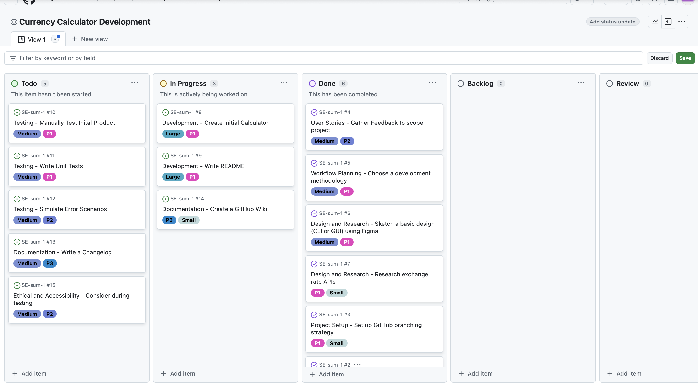
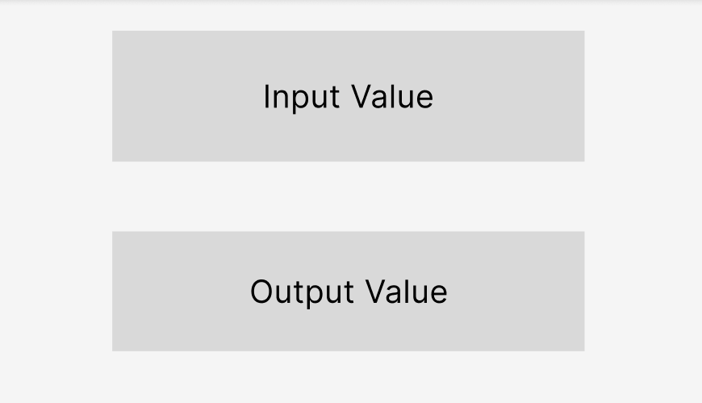
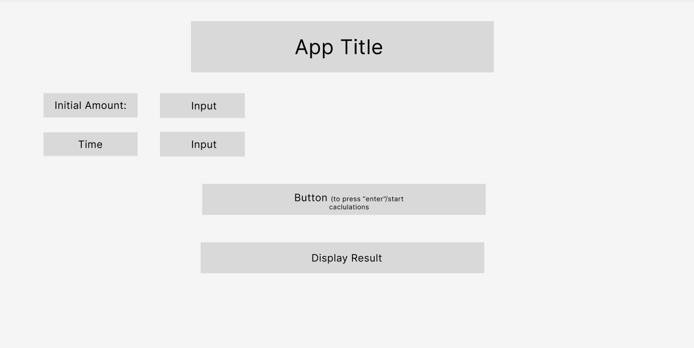
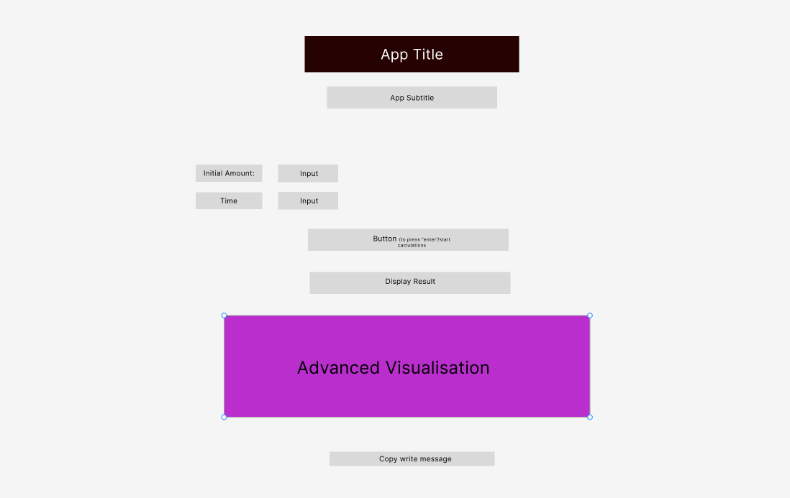
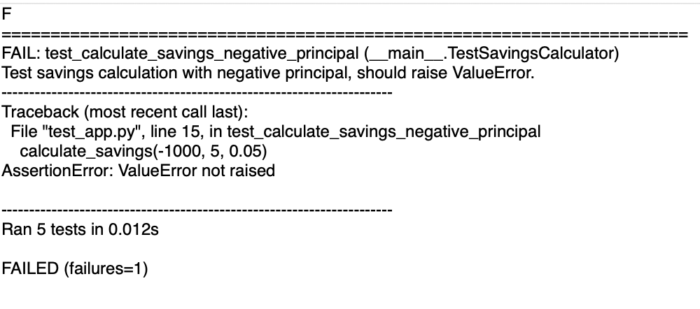
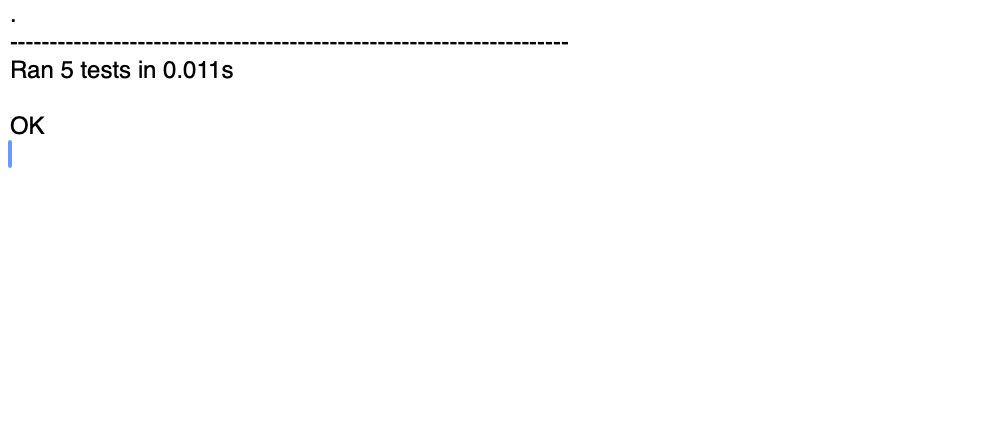
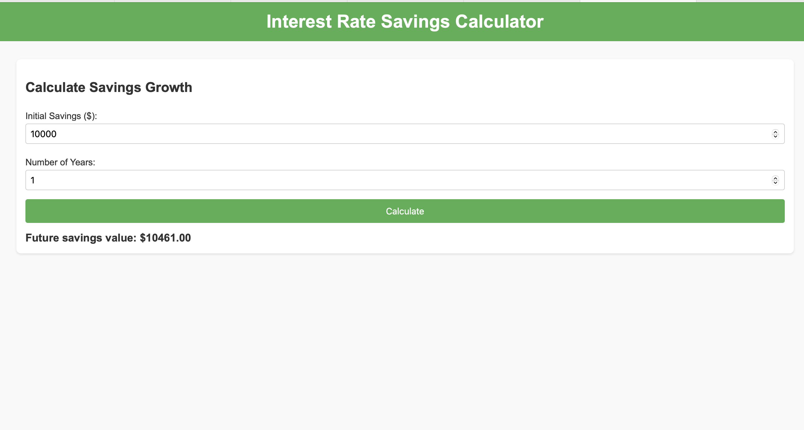
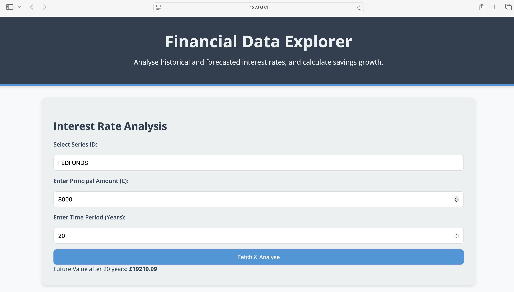
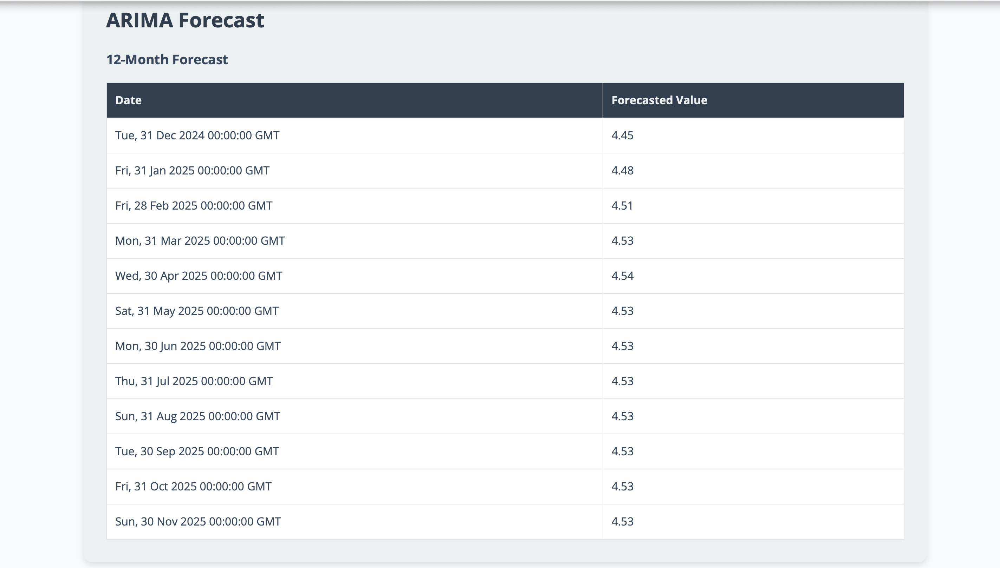
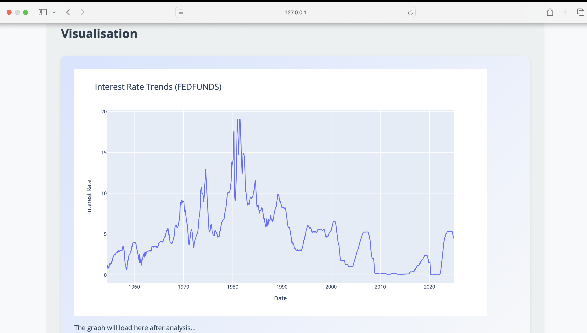

# 🎯 Financial Data Explorer README

# 📑 Table of Contents
1. [🎯 Assignment Aim](#-assignment-aim)
2. [Stakeholder Requirements/User Stories](#stakeholder-requirementsuser-stories)
    - [🧑‍💼 User Story 1](#-user-story-1)
    - [🏡 User Story 2](#-user-story-2)
    - [🛠 User Story 3](#-user-story-3)
3. [Planning](#planning)
    - [🛠 Why Kanban?](#-why-kanban)
    - [📋 Kanban Board Implementation](#-kanban-board-implementation)
    - [🔄 Stakeholder Feedback](#-stakeholder-feedback)
4. [Figma Prototyping](#figma-prototyping)
    - [🎨 Design Stages](#-design-stages)
    - [Design Highlights](#design-highlights)
5. [Software Engineering Practices](#software-engineering-practices)
    - [🧪 5.1 Testing and Test-Driven Development (TDD)](#-51-testing-and-test-driven-development-tdd)
    - [🌱 5.2 Branches and Pull Requests](#-52-branches-and-pull-requests)
    - [🐞 5.3 Issue Tracking and Bug Management](#-53-issue-tracking-and-bug-management)
6. [Ethical, Accessible, and Secure Development](#ethical-accessible-and-secure-development)
7. [Final Product Showcase](#final-product-showcase)
    - [🔑 Key Features](#-key-features)
8. [Critical Reflection](#critical-reflection)
    - [✅ 8.1 Strengths](#-81-strengths)
    - [❌ 8.2 Limitations](#-82-limitations)
    - [💡 8.3 Lessons Learned](#-83-lessons-learned)
    - [💡 8.4 Recommendations for Future Development](#-84-recommendations-for-future-development)
9. [📚 References](#-references)

## 1. Assignment Aim
The objective of this assignment was to design, develop, and evaluate a software product that incorporates advanced software engineering practices while addressing a real-world problem. The project was guided by the following goals:
1. **Problem Identification**: Develop a practical solution tailored to stakeholder needs, delivering measurable benefits to both professional and individual users.
2. **Planning and Design**: Use modern planning frameworks, such as Agile and Figma prototyping, to structure and visualise the development process iteratively.
3. **Implementation and Testing**: Showcase best practices, including test-driven development (TDD), project management, and GitHub, to produce a maintainable, scalable codebase.
4. **Evaluation and Reflection**: Critically assess the project’s strengths, limitations, and key lessons learned.

The final product, the Financial Data Explorer, is a web application that provides real-time financial data, predictive analytics, and personalised savings calculations. This tool aims to bridge the gap between accessibility for normal users and technical expertise for professionals.

## 2. Stakeholder Requirements/User Stories
The design process prioritised stakeholder needs, ensuring the software provided real value. The following user stories highlight key expectations:

### 🧑‍💼 User Story 1
As a financial analyst, I need to visualise trends and predict future interest rates so that I can make informed decisions.  
**Requirements:**  
- Integration of real-time data feeds.  
- Reliable and accurate forecasting methods, such as ARIMA models.  
- Interactive visualisations for data analysis.  

### 🏡 User Story 2
As an individual, I want a user-friendly savings calculator so that I can plan my financial growth effectively.  
**Requirements:**  
- Simple and intuitive input forms.  
- Clear outputs in both numerical and graphical formats.  
- Support for dynamic financial scenarios based on real-time rates.  

### 🛠 User Story 3
As a product manager, I need a professional interface that meets accessibility standards and is responsive on all devices.  
**Requirements:**  
- Accessibility features, such as keyboard navigation and screen reader compatibility.  
- Responsive design for seamless use on mobile, tablet, and desktop.  

Stakeholders’ iterative feedback shaped these user stories, ensuring alignment with end-user expectations and practical applicability. This approach is consistent with the Agile principle of valuing customer collaboration over rigid documentation (Beck et al., 2001).

## 3. Planning

### 🛠 Why Kanban?

*Figure x: Kanban.*

Kanban was selected as the project management methodology for its flexibility and visual task tracking, essential for iterative development. According to Atlassian (2023), “Kanban allows teams to focus on workflow, identify bottlenecks, and adapt quickly to changes,” making it ideal for evolving projects like this.

An evaluation of alternatives, such as Waterfall, showed potential limitations in handling changes to requirements mid-development. Agile Kanban’s ability to continuously integrate feedback made it more suitable, aligning with the assignment's objectives of adaptability and iteration.

### 📋 Kanban Board Implementation
Tasks were organised on a GitHub Projects board into four columns:  
- **To Do**: Tasks identified during sprint planning.  
- **In Progress**: Active development items.  
- **Review**: Completed tasks awaiting testing and feedback.  
- **Done**: Finalised deliverables ready for deployment.  

Each task was labelled with priorities such as P1 (High Priority) or Bug, ensuring clarity in resource allocation. Dependencies, like API integration for ARIMA models, were tracked to prevent bottlenecks.

*Figure x: Image Showing Kanban Usage at Planning Stage.*

### 🔄 Stakeholder Feedback
Daily stand-ups and sprint reviews allowed stakeholders to monitor progress and suggest refinements. For example, a suggestion to include tooltips for input fields was incorporated to improve usability.

**Placeholders:**  
- Screenshot of Kanban board with tasks in progress.  
- Image of a task card highlighting labels and priority levels.

## 4. Figma Prototyping
The UI design was developed iteratively using Figma, balancing stakeholder feedback with accessibility requirements.

### 🎨 Design Stages
1. **Wireframing**: Focused on structure and navigation. Elements like input fields and visualisation areas were positioned to prioritise ease of use.
 
*Figure x: Initial FIGMA Design.*
3. **Prototyping**: Introduced interactive buttons, and responsive layouts to create a high-fidelity design.

*Figure x: Prototype FIGMA Design.*
5. **Final Design**: Integrated colour schemes,accessibility improvements, including ARIA labels and contrast adjustments.

*Figure x: Final FIGMA Design.*

### Design Highlights
- **Accessibility**: The UI adhered to WCAG 2.1 standards, ensuring inclusivity for visually and motor-impaired users (World Wide Web Consortium, 2018).  
- **Responsiveness**: Optimised for different devices to provide a seamless experience across mobile and desktop.

## 5. Software Engineering Practices
The development of the Financial Data Explorer followed rigorous software engineering practices to ensure maintainability, scalability, and high-quality output.  

### 🧪 5.1 Testing and Test-Driven Development (TDD)  
Test-driven development was central to ensuring the reliability and robustness of the application. Following the TDD paradigm, test cases were written before implementation, which helped identify edge cases early and facilitated iterative development.  

#### Unit Testing  
Unit tests were implemented for all core functionalities, such as:  
- **Savings Growth Calculations**: Tests verified outputs for varying principal amounts, time periods, and interest rates.  
- **API Integration**: Mock responses were used to simulate FRED API data and validate the parsing logic.  

The Jest framework was chosen for its speed, ease of use, and support for mocking dependencies. For example, test cases were written to ensure that invalid inputs (e.g., negative savings amounts) returned appropriate error messages.  

> *"TDD provides an early warning system for errors, ensuring fewer bugs reach production"* (Beck, 2002). This was evident during the development of the ARIMA forecasting module, where early unit tests caught edge cases, such as missing data points in the API response.  

#### Integration Testing  
Integration tests were designed to ensure seamless communication between the following modules:  
- **Forecasting Module and API**: Ensured the ARIMA model processed API data correctly.  
- **Savings Calculator and Visualisations**: Verified that outputs displayed in graphs matched calculated values.  

Testing revealed issues with handling API rate limits, which were resolved by implementing a caching mechanism to reduce unnecessary requests.  

#### Stakeholder-Informed Testing  
Stakeholder feedback was incorporated into usability testing. For instance, initial tests identified confusion around input field validation, leading to the addition of real-time error messages and tooltips.  

**Challenges**: Writing comprehensive tests for dynamic modules like the ARIMA model required extra effort, but this significantly reduced debugging during integration.  

*Figure x: Image Showing Unittest Fail.*

 *Figure x: Image Showing Unittest Pass.*

### 🌱 5.2 Branches and Pull Requests  
GitHub was used extensively for version control, enabling collaborative workflows and maintaining a clean codebase.  

#### Feature Branching  
Each feature was developed in a separate branch (e.g., `feature-arima-forecasting`), adhering to a structured naming convention. This approach minimised conflicts and allowed for isolated development.  

#### Pull Requests and Code Reviews  
Pull requests included:  
- Detailed descriptions of changes.  
- Automated test results generated via GitHub Actions.  
- Reviewer comments to ensure code quality.  

For example, during the ARIMA implementation, the pull request included test logs, a changelog, and a summary of challenges encountered.  

**Placeholder**: Add a screenshot of a pull request with linked issues and test results.  

### 🐞 5.3 Issue Tracking and Bug Management  
GitHub Issues were used to document and prioritise tasks, with labels such as Bug and Feature. Tasks were categorised by priority:  
- **P1 (High Priority)**: Essential tasks, such as API integration.  
- **P2 (Medium Priority)**: Non-critical enhancements, like adding tooltips.  

**Example**: A bug related to API rate limits was resolved by implementing retry logic and error handling for failed requests.  

**Placeholder**: Screenshot of a GitHub Issues.

## 6. Ethical, Accessible, and Secure Development
The Financial Data Explorer ensured inclusivity, fairness, and security:  

- **Accessibility**: Designed to WCAG 2.1 standards, with keyboard navigation, ARIA labels, and high-contrast themes (World Wide Web Consortium, 2018). As Mace (1985) noted, *“accessible design benefits all users, not just those with disabilities.”*  
- **Ethics**: Fully GDPR-compliant, with no personal data collected, protecting privacy (ICO, 2023). Forecasting models were free of bias, and outputs were transparently explained.  
- **Security**: Used environment variables to secure API keys, HTTPS protocols to encrypt data, and role-based access to restrict unauthorised actions.  

These measures ensured the application was inclusive, trustworthy, and secure.

## 7. Iterative Journey: From Concept to Final Product

This section narrates the development journey of the Financial Data Explorer, showcasing the iterative improvements made over time. It highlights how the project evolved from a basic Python script to a polished and user-friendly web application, with each stage representing key advancements in functionality, usability, and design.

### 🛠 Initial Version: A Basic Python Script
The first iteration of the Financial Data Explorer was a simple command-line application written in Python.  
- **Functionality**: This version utilised the FRED API to fetch real-time financial data and calculate savings growth based on user input.  
- **Limitations**: While functional, it lacked a graphical interface, requiring users to interact solely via the command line. Additionally, error handling was minimal, and accessibility was not considered.  

**Placeholder**: Screenshot of the Python code output and a snippet of the script.  

---

### 🚧 Intermediate Version: Early Web Application
The next iteration was a basic web application that introduced a graphical user interface using Flask.  
- **Advancements**: The web app retained core functionalities, such as fetching data from the FRED API and performing savings calculations, but with a more accessible user interface.  
- **Challenges**: Despite improvements, the design was not aesthetically pleasing, and the application contained several usability and performance issues, such as slow API requests and inconsistent input validation.  

*Figure x: Intermediate Iteration of Product.*

---

### ✨ Final Version: The Polished Web Application
Building on the lessons learned from previous iterations, the final product introduced significant enhancements in functionality, design, and usability:  
- **Testing**: Comprehensive testing, including unit tests, integration tests, and stakeholder-informed usability testing, addressed bugs and improved performance.  
- **Design and Accessibility**: WCAG 2.1 standards were implemented, and the interface was optimised for responsiveness, making it accessible across devices.  
- **Caching Mechanisms**: Added to handle API rate limits and improve data retrieval efficiency.

-                          **ADD STUFF ABOUT THE FINAL VERSION**

*Figure x: Final Iteration of Product.*

---

### Lessons Learned Through Iteration
The iterative approach allowed the project to evolve from a simple tool to a robust application. Key lessons included:  
1. **Early Prototypes Matter**: Early feedback helped identify critical design and functionality gaps.  
2. **Testing is Essential**: Bugs and inefficiencies were systematically resolved by incorporating rigorous testing practices.  
3. **User Feedback Drives Improvement**: Stakeholder input during each iteration directly influenced design decisions and feature prioritisation.

### For more detailed user and technical documentation, please visit the [Wiki](https://github.com/joegrimshaw2002/SE-sum-1/wiki).

## 8. Critical Reflection
This section evaluates the project’s success by examining its strengths, limitations, and key lessons learned.

### ✅ 8.1 Strengths
1. **Technical Sophistication**  
   The integration of ARIMA models demonstrated an advanced understanding of time-series forecasting. ARIMA’s adaptability to non-seasonal data made it an ideal choice for short-term financial predictions (Hyndman and Athanasopoulos, 2018).

2. **User-Centric Design**  
   Accessibility features aligned with WCAG 2.1 standards ensured inclusivity. For example, ARIA labels and high-contrast themes catered to visually impaired users (World Wide Web Consortium, 2018).

3. **Professional Workflows**  
   Agile Kanban provided a flexible framework for task management, while GitHub Actions ensured CI pipelines maintained code quality. These practices align with Beck’s (2001) emphasis on iterative development and collaboration.

### ❌ 8.2 Limitations
1. **API Dependency**  
   The reliance on the FRED API introduced challenges, such as rate limits and potential downtime. While caching mitigated some issues, the system remains dependent on external data sources.

2. **Forecasting Complexity**  
   ARIMA performed well for short-term predictions but struggled with datasets containing seasonal patterns. Future iterations could explore SARIMA or machine learning models for improved accuracy (Hyndman et al., 2018).

3. **Time Constraints**  
   Some advanced features, like user-specific settings, were deprioritised due to limited development time.

### 💡 8.3 Lessons Learned
1. **Value of TDD**  
   Even though it can take time and can feel painful, writing tests before implementation reduced debugging time overall significantly. As Beck (2002) highlights, *“TDD ensures cleaner code by preventing issues from the outset.”*

2. **Importance of Accessibility**  
   Iterative testing with tools like Lighthouse revealed critical accessibility issues that were resolved before deployment. This experience reinforced the importance of prioritising inclusivity in design (Mace, 1985).

3. **Value of Following Best Practices for Software Engineering**  
   The learning curve for this task was steep but rewarding. Even though the overall process of following best practice and not cutting corners adds a lot more time, it allows for very clear, accountable, and effective code and development.

### 💡 8.4 Recommendations for Future Development
- **Pre-Commit Hooks and Linting**: Implement tools like ESLint or Prettier to enforce coding standards automatically before committing. As Fowler (1999) notes, *“clean code reduces technical debt and ensures maintainability.”*  
- **Enhanced CI/CD Pipelines**: Integrate static code analysis and vulnerability scanning tools (e.g., SonarQube), which OWASP (2023) recommends for identifying security flaws early.  
- **Mutation Testing**: Use tools like Stryker to evaluate test suite robustness by simulating code changes. Beck (2002) highlights that *“strong testing increases confidence in software reliability.”*  
- **Automated Documentation**: Generate consistent technical documentation with tools like JSDoc to reduce manual effort and streamline onboarding (World Wide Web Consortium, 2018).

## 📚 References
- Beck, K. (2002). *Test-Driven Development: By Example*. Addison-Wesley Professional.  
- Beck, K., et al. (2001). *Agile Manifesto*. Available at: [https://agilemanifesto.org](https://agilemanifesto.org) [Accessed 21 Jan. 2025].  
- Fowler, M. (1999). *Refactoring: Improving the Design of Existing Code*. Addison-Wesley Professional.  
- Hyndman, R.J. and Athanasopoulos, G. (2018). *Forecasting: Principles and Practice*. 2nd ed. Available at: [https://otexts.com/fpp3/](https://otexts.com/fpp3/) [Accessed 18 Jan. 2025].  
- ICO (2023). *Guide to the General Data Protection Regulation (GDPR)*. Available at: [https://gdpr-info.eu](https://gdpr-info.eu) [Accessed 22 Jan. 2025].  
- Mace, R.L. (1985). *Universal Design: Barrier-Free Environments for Everyone*. Designers West.  
- OWASP (2023). *OWASP Dependency-Check*. Available at: [https://owasp.org/www-project-dependency-check/](https://owasp.org/www-project-dependency-check/) [Accessed 18 Jan. 2025].  
- Parnas, D.L. (1979). *Designing Software for Ease of Extension and Contraction*. IEEE Transactions on Software Engineering, 5(2), pp. 128–138. Available at: [https://ieeexplore.ieee.org/document/170265](https://ieeexplore.ieee.org/document/170265) [Accessed 18 Jan. 2025].  
- World Wide Web Consortium (2018). *Web Content Accessibility Guidelines (WCAG) 2.1*. Available at: [https://www.w3.org/TR/WCAG21/](https://www.w3.org/TR/WCAG21/) [Accessed 18 Jan. 2025].

